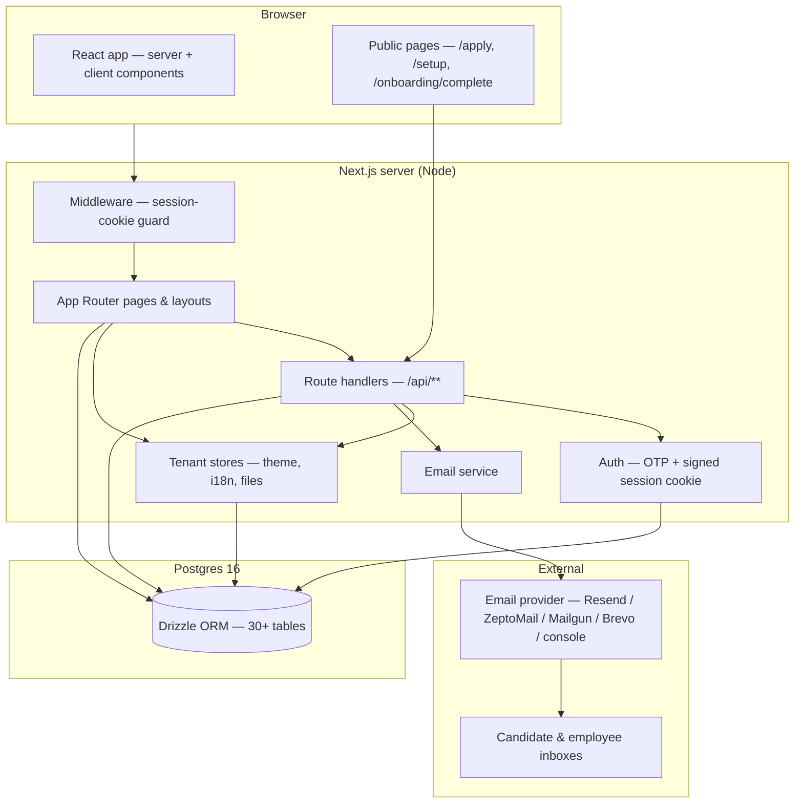
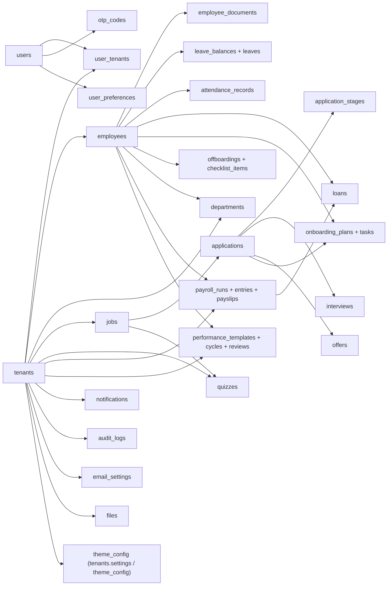

# Gente HR — Architecture & Feature Guide

Gente HR is a **multi-tenant HR platform**: every company ("tenant") gets an
isolated workspace with its own employees, payroll, ATS, branding, language
and email configuration, while the whole product is one shared Next.js
application.

This document explains how the system is connected and what every feature
does. For setup, scripts and contribution, see `README.md`.

---

## 1. System architecture



### Request lifecycle

1. **Middleware** (`src/middleware.ts`, edge runtime) guards every page except
   public routes (`/login`, `/setup`, `/apply`, `/onboarding/complete`, `/api`,
   static assets). It only checks for the presence of the `gente_session`
   cookie; pages verify the actual signature server-side.
2. **Tenant resolution** — server helpers read the signed session cookie and
   resolve the current tenant (`getTenantId()`). Public routes fall back to a
   demo tenant so theming/i18n still work pre-login.
3. **Per-request stores** — the root layout loads the tenant's **theme**
   (palette, mode, logo) and **language**, embeds the CSS variables before
   first paint (`ThemeScript`, zero FOUC) and provides the active dictionary
   (`TranslationsProvider`).
4. **API routes** authenticate via `getCurrentUser()`/`requireRole()` and run
   Drizzle queries against Postgres. Everything is scoped by `tenantId`.

### Data model overview



---

## 2. Core platform

### Multi-tenancy

Every row in a tenant's workspace carries `tenantId`. The sign-in flow
creates a session for the _current_ tenant; super-admins can switch
organizations from the header (`/api/auth/switch-tenant` re-signs the cookie).
The seeder provisions **Acme Inc.** plus a second tenant (Globex) so
multi-org switching can be tested immediately.

### Authentication (passwordless OTP)

- `POST /api/auth/request-otp` — looks up the user, hashes a 6-digit code into
  `otp_codes` (10-minute expiry, 5 attempts, 60s resend throttle).
- Delivery is handled by the email service (see §10); without credentials the
  code is printed to the server console.
- `POST /api/auth/verify-otp` — on success issues a **stateless** session
  cookie (`gente_session`, httpOnly, HMAC-signed with `AUTH_SESSION_SECRET`).
  No session rows are stored.
- `switch-tenant`, `logout`, `me` complete the auth surface.

### First-run setup wizard (`/setup`)

Public wizard that provisions a brand-new workspace: organization profile,
website/about, timezone, base currency, language, admin email, email sender,
default color mode and starting theme. Also used from invite links.

### Roles

`admin` (all settings + every tenant for super-admins), `hr` (people
workflows), `member` (self-service only). Access checks run on both pages
(`redirect("/")` for members) and API routes (`requireRole([...])`).

---

## 3. Hiring — ATS (`/ats`)

- **Jobs** (`/ats/jobs`) — rich-text descriptions (WYSIWYG → HTML), salary
  range, employment type, location, status (draft/open/closed). Jobs carry
  **screening questions** and an optional **quiz**.
- **Public apply page** (`/apply/[jobId]`) — unauthenticated; collects name,
  email, phone, **country/state** (dropdowns with flags), a **resume/CV file
  upload**, cover letter, answers to screening questions and the attached
  quiz. The company profile (about, email, phone, website) is rendered from
  tenant settings. Submissions create an `applications` row at stage
  `applied`.
- **Pipeline** (`/ats/applications`) — kanban board grouped by stage
  (applied → screening → interview → offer → hired/rejected) with a job
  filter and manual candidate entry.
- **Application detail** — timeline of stage changes, scheduled interviews
  (datetime picker + multi-select panelists fetched from `/api/employees`),
  offer (salary/start/terms), quiz results, and **hire** → creates the
  employee record and an onboarding plan in one step.
- **Quizzes** (`/ats/quizzes`) — multiple-choice screening assessments
  (question, options, correct answer) attachable to any job.

## 4. Employees (`/employees`)

- Directory with search and department filter; role-gated (members see only
  their own profile at `/profile`).
- Profile page: contact info, employment (department, designation, manager,
  join date, contract type), **salary breakdown** (annual gross split by
  configured payroll components), bank details, government ID, health
  insurance, pension, emergency contact, documents, attendance and leave
  history for the employee.
- `EmployeeEditForm` (admin/hr) edits everything; the **employee config**
  settings control which field groups appear and whether fields are required.
- Documents upload to the tenant `files` table (demo storage) and are served
  through authenticated `/api/files/[id]`.

## 5. Attendance (`/attendance`)

Daily check-in/check-out (geo-location optional, office/location tags),
today's presence summary, weekly trend and department breakdown. Staff
members check in from their dashboard.

## 6. Leave (`/leave`)

- **Balances** per type (vacation, sick, personal) with used/remaining for the
  current year.
- Requests with date range (working-day aware), reason and type; approvers can
  **approve / reject / extend**; employees can cancel.
- Team calendar view and self-service "my requests" with a timeline of
  decisions.

## 7. Payroll (`/payroll`)

- **Runs** — monthly processing with a preview step; runs produce entries per
  employee and a PDF payslip per employee.
- **Payslips** — earnings (basic, HRA, transport, bonus, …) and deductions
  (tax, pension, insurance, loan EMI) driven by the **payroll breakdown**
  settings; download PDF (`pdf-lib`) or email it.
- **Loans** — principal, interest rate, term; EMI schedule; approval flow;
  outstanding balance feeds the payslip deduction.

## 8. Performance (`/performance`)

- **Templates** — sections with questions, active/inactive, used to start
  review cycles.
- **Cycles** — start a review for an employee (template + deadline) which
  emails the reviewer; deadlines can be extended.
- **Reviews** — self-rating + manager rating, strengths/growth feedback,
  overall score; progress tracked per cycle.

## 9. Onboarding & offboarding

### Onboarding (`/onboarding`)

1. Admin **invites a new hire** (name + email) → the invite email links to
   the public completion page (`/onboarding/complete`).
2. The new hire fills personal details, passport photo, signed offer letter,
   bank, ID, tax, health coverage and pension.
3. Submitting creates the `users` + `employees` rows and generates the
   **task checklist** (HR/IT/Admin) shown on the plan page with progress bars.

### Offboarding (`/offboarding`)

HR starts an exit process for an employee: reason (resignation, termination,
retirement, …), last working day, notes and a selectable checklist (asset
return, access revocation, exit interview, final settlement, experience
letter). The checklist can be toggled complete; notes/exit-interview
takeaways are captured.

## 10. Email delivery (`/settings/email`)

A tenant-level email service abstraction (`src/lib/server/email.ts`):

- Providers: **Resend**, **ZeptoMail**, **Mailgun**, **Brevo**, and a
  **console** provider for development.
- Per-provider credential fields stored on the tenant's `email_settings`
  (secrets never returned by the API).
- Templates: OTP verification, welcome, leave requests/approvals, payslip
  delivery, onboarding tasks, offboarding confirmation — each with an
  email/push/both channel and a **test email** modal (delivered using the
  saved tenant config).
- Any provider failure falls back to the console so callers never hard-fail.

## 11. Branding, theming & i18n

- **Themes** (`/settings/branding`) — 8 predefined palettes + custom editor
  with live preview, WCAG 2.1 contrast checks, logo/favicon uploads and JSON
  export/import. Colors are CSS variables applied per-request (zero FOUC).
- **Language** (`/settings/general`) — English, Spanish, French, Portuguese.
  The chosen language drives `<html lang>`, the active dictionary and
  locale-aware `Intl` dates/numbers/pickers.
- Dictionaries are structurally validated (`pnpm i18n:validate`); adding a UI
  string means adding it to all four JSON files.

## 12. Reporting, notifications & audit

- **Reports** (`/reports`) — workforce metrics (headcount, on-leave, pending
  leave, payroll totals, departments) and detail reports with CSV export.
- **Notifications** — in-app center with unread badge; preference toggles per
  event type (email/push).
- **Audit logs** — every sensitive action is recorded (actor, action, target,
  category) and browsable in `/settings/audit-logs`.

---

## 13. Deployment

```bash
# Local development
docker compose up -d db && pnpm install && pnpm db:migrate && pnpm db:seed && pnpm dev

# Production (Docker, full stack)
docker compose up -d --build        # db + app on :4001

# Manual image
# docker build -t gente .
# docker run -p 4001:4001 \
#   -e DATABASE_URL=postgres://postgres:postgres@db:5432/gente \
#   -e AUTH_SESSION_SECRET=change-me \
#   gente
```

The Docker entrypoint applies migrations (`RUN_MIGRATIONS=1`) and optionally
seeds (`RUN_SEED=1` on first boot) before starting `server.js` on `:4001`.
The same image can be run as app, migrator or seeder, so one artifact serves
the whole lifecycle.

The **GitHub Actions workflow** (`.github/workflows/docker.yml`) runs lint,
typecheck and the i18n validation, then builds the image and publishes it to
**GitHub Container Registry** (`ghcr.io/kimolalekan/gente-hr`) on every push
to `main` (`latest` + commit SHA tags) and on `v*` version tags (semver tags).

### Environment variables

| Variable                      | Purpose                                              |
| ----------------------------- | ---------------------------------------------------- |
| `DATABASE_URL`                | Postgres connection string (required)                |
| `AUTH_SESSION_SECRET`         | HMAC key for session cookies (required, long/random) |
| `BASE_URL`                    | Public base URL for email links                      |
| `PORT`                        | HTTP port (default `4001`)                           |
| `SEED_*`                      | Override seeder identities (tenant, users, …)        |
| `RUN_MIGRATIONS` / `RUN_SEED` | Docker entrypoint behavior (default `1` / `0`)       |
